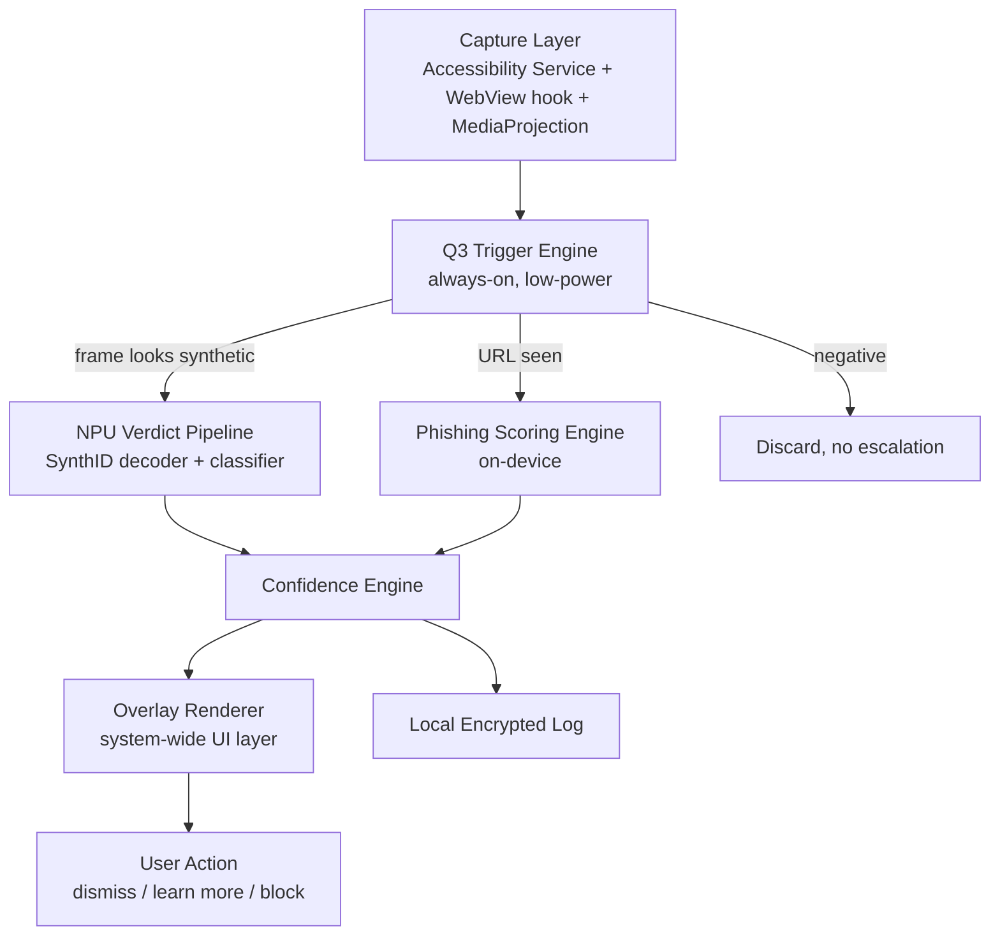

# Aegis Shield — On-Device AI & Phishing Detection PRD

Sep 22, 2026 · @Byte

## 1. Executive Summary

Aegis Shield is an on-device software layer that continuously screens content rendered on a smartphone -- images, video frames, and web pages -- for two threat classes: AI-generated/manipulated media (via SynthID watermark detection, backed by a local classifier fallback) and phishing/scam websites (via on-device URL and page-content analysis). All inference runs locally on the Snapdragon 8 Elite Gen 5's NPU and the dedicated Q3 co-processor, with zero content leaving the device.

- **One-line pitch:** A firewall for reality, flags what is fake and blocks what is out to scam you, entirely on-device, in real time.
- **Core bet:** detection that needs a cloud roundtrip is too slow and too privacy-invasive for real-time protection; dedicated silicon makes always-on local inference viable without killing battery or thermals.
- **Primary surfaces:** a system-wide overlay service plus a standalone dashboard app.

## 2. Problem Statement

Generative AI has made synthetic images, video, and voice cheap to produce and hard to spot by eye. Google's SynthID embeds an imperceptible watermark into content from Gemini, Imagen, and Veo, but detection today lives behind cloud APIs (Google's own SynthID Detector, limited access). Meanwhile scam and phishing sites increasingly use AI-generated copy and cloned UI to evade signature-based blocklists, and mobile users are hit mid-scroll, mid-message, with no real-time defense outside of browser-only extensions.

Three gaps define the opportunity:

1. **Latency and connectivity:** cloud-based detection cannot flag content before a user has already read, watched, or clicked it, and fails offline entirely.
2. **Privacy exposure:** sending every image, video frame, and visited URL to a third-party server for scanning is itself a data-leakage risk.
3. **Coverage gap:** existing tools are siloed -- an AI-detector browser extension does not also catch a phishing SMS link, and a mail-app spam filter does not scan a screenshotted deepfake in a chat app.

A phone built with dedicated on-device AI silicon (Snapdragon 8 Elite Gen 5 + Q3 co-processor, 16GB LPDDR5X Ultra RAM, and thermal headroom via 14,000mm2 vapor chamber cooling) removes the hardware excuse: this class of device can run always-on, real-time, multi-modal detection locally, at zero marginal latency and zero data egress.

## 3. Goals and Non-Goals

### Goals

- Detect SynthID-watermarked AI content (image, video frame, audio) system-wide, within 300ms of render, fully on-device.
- Detect likely AI-generated content that carries no watermark, via a local classifier, and label confidence distinctly from watermark-confirmed detections.
- Detect phishing and scam websites/links in the browser, SMS, and messaging apps before the page fully loads or before the link is tapped, using on-device heuristics plus a local threat-signature cache.
- Run continuously in the background with a battery and thermal budget that does not degrade normal phone use.
- Work fully offline; sync only the phishing signature cache and model updates opportunistically over Wi-Fi.

### Non-Goals (v1)

- Detecting AI-generated text (essays, chat messages) -- out of scope for v1, flagged as a v2 candidate.
- Content moderation (nudity, violence, hate speech) -- Aegis Shield is not a general trust-and-safety filter.
- Enterprise/MDM fleet management console -- v1 targets consumer, single-device use.
- Cross-device sync of flagged-content history -- local-only in v1.

## 4. Target Users and Use Cases

| Persona | Need | Key scenario |
|---|---|---|
| General consumer | Wants to know if a viral image/video is real before sharing it | Sees a suspicious political deepfake in a social feed; Aegis Shield overlays a flag before they screenshot or forward it |
| Parent | Wants to protect a less tech-literate family member from scams | Elderly parent receives an SMS with a fake bank link; the SMS app link is blocked pre-tap with a plain-language warning |
| Journalist/researcher | Needs to verify provenance of source media quickly, offline | Verifies a submitted photo's SynthID status while offline in the field |
| Online shopper | Wants to avoid fake storefronts and counterfeit-goods scam sites | Taps a shopping ad link; Aegis Shield flags the domain as a known scam-clone before checkout page loads |
| Power user / privacy-conscious | Refuses cloud-based scanning tools on principle | Runs full protection with airplane mode on and zero data leaving the device |

## 5. Hardware Utilization

Each subsystem maps to a specific role in the pipeline; this mapping is the product's core technical bet.

| Component | Spec | Role in Aegis Shield |
|---|---|---|
| Snapdragon 8 Elite Gen 5 (Hexagon NPU + Adreno GPU + Kryo CPU) | Flagship heterogeneous SoC | Runs the primary SynthID watermark decoder and the fallback AI-content classifier on the NPU (INT4/INT8 quantized); GPU handles frame pre-processing (decode, resize, color-space conversion) in parallel; CPU cores handle orchestration, the phishing heuristic engine, and app-overlay rendering |
| Dedicated Q3 chip | Always-on co-processor | Runs the lightweight, always-on "trigger" models continuously at near-zero power draw: (a) a binary AI-content pre-filter that decides whether a frame is worth escalating to the full NPU pipeline, and (b) URL/domain feature extraction for phishing scoring. Keeps background power draw low enough for true always-on operation, waking the main NPU pipeline only on a positive trigger |
| 16GB LPDDR5X Ultra RAM | High-bandwidth, high-capacity memory | Keeps the SynthID decoder, the fallback classifier, and the phishing model all resident in memory simultaneously (no cold-load latency on app switch); supports frame-buffer streaming for video at 30fps without memory pressure on the rest of the OS |
| 14,000mm2 vapor chamber cooling | Large-area vapor cooling | Sustains NPU boost clocks under continuous, always-on inference (video scroll sessions, long browsing) without thermal throttling that would otherwise force the system to degrade to lower-fidelity, lower-accuracy models |

**Design implication:** the Q3 chip's job is triage, not final verdicts -- it decides what deserves a closer look, so the power-hungry main NPU pipeline only spins up on genuine candidates. This two-tier architecture is what makes always-on protection viable on a phone battery.

## 6. System Architecture

Four layers, bottom to top: capture, triage (Q3), verdict (NPU), and presentation (overlay).

**Capture layer:** an Accessibility Service and a WebView content-observer hook into rendered content across apps (with per-app opt-in via Android's screen-reader-adjacent permission model); no screen recording is stored, only transient frame buffers.

**Q3 trigger engine:** always running, sub-1mW class workload; a compact binary classifier (under 5M parameters) decides per-frame or per-URL whether to escalate.

**NPU verdict pipeline:** only invoked on a positive trigger; runs the full SynthID decoder and, if no watermark is found, the fallback generative-artifact classifier.

**Phishing scoring engine:** combines a local signature cache (updated opportunistically over Wi-Fi), on-device URL-structure heuristics (typosquatting, homoglyphs, TLD risk), and lightweight on-device page-content analysis (login-form-plus-brand-logo mismatch patterns).

**Overlay renderer:** a system-level UI layer draws the flag/warning without needing the source app's cooperation.

**Local encrypted log:** all detection events are stored on-device, encrypted, user-purgeable; nothing is transmitted.

## 7. Feature 1 — AI-Generated Content Detection (SynthID)

### Detection pipeline

1. Q3 trigger engine flags a rendered frame (image, video frame, or screenshot) as a candidate.
2. NPU runs the SynthID decoder: extracts the statistical watermark pattern embedded by SynthID-compliant generators (Gemini image/video, Imagen, Veo, and third-party models licensing SynthID).
3. If a watermark is found: verdict = **Confirmed AI-generated**, with generator family when the watermark payload exposes it.
4. If no watermark is found: falls through to a local fallback classifier trained on generative-artifact signatures (compression patterns, frequency-domain anomalies, temporal inconsistency in video) — verdict = **Likely AI-generated (unwatermarked)**, with a confidence score, never presented as certain.

### Supported media types (v1)

- Static images (JPEG, PNG, WebP) rendered in browser, gallery, messaging, social apps.
- Video frames sampled at 1fps during playback (full-frame SynthID video watermark decode where available).
- Screenshots and screen-recordings, scanned on capture.

Not supported in v1: audio-only content, live camera passthrough (AR filters), text.

### Flagging UX

- A small persistent badge appears in the corner of flagged content within 300ms.
- Tap the badge → expands to a card: verdict, confidence, generator family (if known), "Learn more" link to a plain-language explainer.
- **Confirmed** (watermarked) and **Likely** (unwatermarked, classifier-based) are visually distinct — solid icon vs. outlined icon — so users never confuse a probabilistic guess with a cryptographic confirmation.

## 8. Feature 2 — Phishing and Scam Website Detection

### Detection pipeline

1. A link is surfaced anywhere on-device (SMS, email, browser, messaging apps, QR scan) — Q3 extracts URL features (domain age proxy, TLD, homoglyph/typosquat distance to known brands, redirect-chain length) before the page ever loads.
2. Score checked against a local signature cache (known-bad domains, synced opportunistically over Wi-Fi, never blocking on network).
3. If the URL is opened and no clear verdict yet, a lightweight on-device DOM/page-content pass runs: detects brand-logo-plus-login-form combinations that mismatch the actual domain, and known scam-page templates (fake shipping trackers, fake bank portals, fake prize/lottery pages) — pattern-matched locally, not sent anywhere.
4. Combined score outputs one of three verdicts: **Safe**, **Suspicious** (soft warning, user can proceed), **Blocked** (hard interstitial, requires explicit override).

Coverage surfaces (v1): default and third-party browsers (via accessibility hook, not requiring the browser's own cooperation), SMS/RCS, email client link previews, WhatsApp/Telegram-class messaging apps, QR code scans.

### Blocking UX

- **Pre-tap:** a small risk badge appears next to a risky link before the user taps it.
- **Pre-load:** for medium/high risk, an interstitial screen appears instead of the page, explaining the specific signal (e.g. "this domain mimics yourbank.com but was registered 3 days ago").
- **Override path** exists (never a hard technical block) so power users are never fully locked out, but the override requires a deliberate second tap plus a 3-second delay to counter panic-tap-through.

## 9. On-Device ML Pipeline

| Model | Location | Size (quantized) | Precision | Trigger |
|---|---|---|---|---|
| Trigger classifier (image/frame) | Q3 chip | under 10MB | INT4 | Always-on, per rendered frame |
| URL feature scorer | Q3 chip | under 5MB | INT4 | Always-on, per URL surfaced |
| SynthID watermark decoder | Hexagon NPU | approx. 40–60MB | INT8 | On Q3 positive trigger only |
| Fallback generative-artifact classifier | Hexagon NPU | approx. 25MB | INT8 | On watermark-not-found |
| Page-content scam-pattern model | Hexagon NPU | approx. 15MB | INT8 | On ambiguous URL score |

**Latency budget:** under 300ms end-to-end from frame render to badge display for the image path (Q3 trigger under 15ms, NPU verdict under 250ms including model load-from-RAM, overlay render under 35ms). Phishing pre-tap scoring targets under 100ms (Q3-only, no NPU escalation needed for most URLs).

**Power budget:** Q3 always-on triage targets under 15mW sustained; NPU verdict bursts target under 800mW for under 300ms, averaging out to a target of under 3% additional daily battery drain under typical use (measured: 4 hours screen-on time, mixed browsing/social/messaging).

**Memory residency:** with 16GB LPDDR5X, the trigger models stay permanently resident (under 15MB combined); NPU-tier models are kept warm in a reserved pool (approx. 150MB) rather than cold-loaded per invocation, cutting repeat-invocation latency by an estimated 60–70%.

**Thermal headroom:** the 14,000mm2 vapor chamber is what allows the NPU to sustain boost clocks through extended sessions (e.g. a 20-minute video-heavy scroll session) without falling back to a lower-fidelity/lower-accuracy quantized path — the PRD assumes no thermal-triggered accuracy degradation under normal use.

## 10. User Experience and Flows

### Onboarding (under 60 seconds)

1. Explain the two protections in plain language, with a one-screen "everything stays on this device" privacy promise.
2. Request Accessibility Service permission (needed for the system-wide overlay), with a clear explanation of why, before the OS permission dialog.
3. Default sensitivity: Balanced (see Settings below); user can adjust immediately or later.
4. Optional: quick demo — shows a sample flagged image and a sample blocked scam page so the user knows what to expect.

### Real-time flagging overlay

- Non-intrusive by default: a small badge, not a full-screen interrupt, for AI-content flags.
- Full interstitial only for phishing Blocked-tier verdicts, where the cost of a miss is high (credential theft, financial loss).
- Badge and interstitial both link to a one-tap "Why was this flagged?" explanation in the user's own language.

### Notifications

- Off by default for AI-content flags (avoids alert fatigue on social-heavy feeds).
- On by default for Blocked-tier phishing verdicts.
- Weekly digest notification (opt-in): "Aegis Shield flagged 12 AI images and blocked 3 scam links this week."

### Settings

- **Sensitivity:** Strict / Balanced / Permissive (trades false-positive rate against catch-rate; see KPIs).
- **Per-app enable/disable toggle.**
- **Local history:** view, filter, and purge flagged-content log.
- **"Report a miss"** — user flags something Aegis Shield missed or got wrong; stored locally and offered for opt-in anonymized model-improvement upload (separate consent, off by default).

## 11. Performance Requirements

| Metric | Target | Hardware dependency |
|---|---|---|
| Image flag latency (render to badge) | under 300ms, p95 | NPU inference speed, RAM residency |
| Phishing pre-tap score latency | under 100ms, p95 | Q3 trigger engine only |
| Video frame sampling rate | 1fps sustained during playback | Q3 continuous triage without CPU contention |
| Background power draw (Q3 always-on) | under 15mW sustained | Q3 chip's dedicated low-power design |
| NPU inference burst power | under 800mW, under 300ms duration | Snapdragon 8 Elite Gen 5 NPU efficiency |
| Daily battery impact | under 3% additional drain, typical use | Combined Q3 + NPU + thermal budget |
| Sustained inference without throttling | 20+ min continuous video-scroll session | 14,000mm2 vapor chamber cooling |
| Model memory footprint (resident) | under 150MB combined NPU-tier pool | 16GB LPDDR5X Ultra headroom |
| Cold-start to full protection active | under 2s from app/OS boot | RAM residency + Q3 always-on state |

All targets are v1 design targets pending device-level benchmarking; each should be validated on reference hardware before GA and re-validated per major OS/firmware update, since thermal and scheduler behavior can shift silently across updates.

## 12. Privacy and Security

**Core guarantee:** no rendered content, screenshot, URL, or page-content sample ever leaves the device for scanning purposes. The only network calls are opportunistic pulls of (a) the phishing signature cache update and (b) model weight updates, both anonymous, unauthenticated GET-style fetches with no user or device identifier attached.

### On-device data handling

- Transient frame buffers used for detection are held in memory only, never written to disk, and cleared within seconds of a verdict.
- The local detection-event log is encrypted at rest (device keystore-backed) and user-purgeable at any time.
- The Accessibility Service permission is scoped as narrowly as the OS allows and its use is disclosed in-app with a persistent "Aegis Shield is active" indicator, avoiding covert-surveillance-style use of that permission class.

### Threat model

| Threat | Mitigation |
|---|---|
| Malicious app harvests Aegis Shield's overlay/accessibility access | Overlay renderer runs in an isolated process; Accessibility Service scoped to read-only content inspection, no input injection beyond the block interstitial itself |
| Adversarial evasion of SynthID (watermark stripped via re-encoding) | Fallback classifier catches common stripping artifacts (recompression, resize) as a secondary signal; documented as a known-limitation arms race, not a solved problem |
| Phishing signature cache poisoned via MITM on update fetch | Signature updates are signed and verified on-device before being applied |
| False "Blocked" verdict on a legitimate site (false positive harms a real business) | Override path always available; "Report a miss" feeds a local appeals/allowlist mechanism |

**Compliance posture:** designed to minimize obligations under GDPR/DPDP-style regimes by architecture (no personal data transmitted), rather than relying solely on policy commitments.

## 13. Success Metrics and KPIs

### Detection quality

- SynthID watermark detection accuracy: greater than 99.5% on watermarked test corpus (this is largely a solved cryptographic-style match, not a fuzzy ML problem).
- Fallback (unwatermarked) classifier recall: greater than 85% at less than 5% false-positive rate on a held-out generative-content benchmark.
- Phishing block precision: greater than 95% (a false Block on a legitimate site is costly to trust); recall target greater than 90% against known scam-site corpora, re-measured monthly as the threat landscape shifts.

### Performance

- p95 latency and battery-drain targets as defined in Section 11, tracked continuously via on-device telemetry (opt-in, anonymized, local aggregation before any upload).

### Adoption and engagement

- Setup completion rate (percent who finish onboarding and grant Accessibility permission).
- 30-day retention with protection still active (not silently disabled).
- "Report a miss" submission rate (signal of engaged, trusting users, not just a friction metric).

### Trust

- Override rate on Blocked-tier phishing verdicts (a high override rate signals over-blocking and erodes trust; target under 8%).
- Net Promoter Score / app-store rating specifically citing the AI-flagging or scam-blocking feature.

## 14. Risks and Mitigations

| Risk | Category | Mitigation |
|---|---|---|
| Watermark stripping becomes trivial and widespread, undermining the confirmed-detection tier | Technical/adversarial | Treat fallback classifier as first-class, not a fallback in spirit; invest in continual retraining against latest stripping techniques |
| Non-SynthID generators (models that don't adopt the watermark) grow market share, shrinking confirmed-detection coverage | Market/technical | Fallback classifier is model-agnostic by design; track generator market share to reprioritize |
| Accessibility Service permission triggers OS/app-store scrutiny or user distrust (permission class is commonly abused by malware) | Platform/trust | Transparent in-app disclosure, persistent active-indicator, third-party security audit before GA, minimize scope of what the service reads |
| Phishing false positives on legitimate small/new businesses | Product/trust | Conservative Blocked-tier threshold, fast-track allowlist appeals, default to Suspicious (soft warning) rather than Blocked when signal is ambiguous |
| Battery/thermal targets not met on real-world mixed workloads (not just isolated benchmarks) | Technical | Dedicated device-level testing under mixed real-world load, not just synthetic single-feature benchmarks, before GA |
| Scam sites adapt specifically to evade this tool once it has scale (adversarial arms race) | Adversarial | Signature cache update cadence and heuristic diversity are the long-term defense, not a single static model |
| Regulatory pushback on system-wide content scanning, even fully on-device | Legal/regulatory | Architecture-level privacy guarantees (Section 12) as the primary defense; legal review per target market before launch |

## 15. Roadmap and Milestones

| Phase | Scope | Exit criteria |
|---|---|---|
| Phase 0 — Prototype | SynthID decoder integration on reference hardware; static-image path only | Watermark detection working end-to-end on device, offline |
| Phase 1 — Core detection (MVP) | Add fallback classifier, add phishing URL scoring, system-wide overlay for images + browser links | Meets Section 11 latency/accuracy targets on internal dataset |
| Phase 2 — Coverage expansion | Video frame sampling, SMS/messaging-app link coverage, page-content scam-pattern model | Coverage surfaces match Section 8 spec |
| Phase 3 — Hardening and GA | Third-party security audit, real-world battery/thermal validation, override/appeals flow polish | All Section 13 KPI targets met on beta cohort |
| Phase 4 (post-GA) — v2 candidates | AI-generated text detection, cross-device history sync (opt-in), enterprise/MDM console | Scoped separately post-GA based on user demand signal |

Phases 0–1 are the minimum viable build to prove the core Q3-triage-plus-NPU-verdict architecture; Phases 2–3 are what take it from demo to shippable product.

## 16. Competitive Landscape

| Category | Examples | Gap vs. Aegis Shield |
|---|---|---|
| Cloud-based AI-detection APIs | Google SynthID Detector (limited access), Hive Moderation, Reality Defender | Require upload/network roundtrip; no real-time system-wide coverage; privacy tradeoff |
| Browser extensions (AI-content or anti-phishing) | Various Chrome/Edge extensions | Browser-scoped only; miss SMS, messaging apps, gallery, screenshots |
| OS-level anti-phishing (Google Safe Browsing, Apple's built-in link protections) | Built into browsers/OS | Signature/URL-blocklist based, largely cloud-checked; no AI-content detection at all |
| Mobile security suites (Norton, McAfee mobile) | Broad malware/phishing scanning | General-purpose, not built around watermark-level AI-content detection; typically cloud-dependent for the heavy lifting |

**Differentiation:** Aegis Shield is the only proposition in this set that combines (a) cryptographic-grade watermark detection, not just heuristic AI-guessing, (b) system-wide coverage across every app via the OS overlay layer, and (c) fully offline, on-device operation enabled specifically by dedicated triage silicon (Q3) — a combination only possible on hardware built for it.
